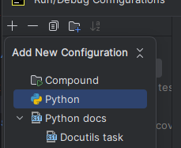

# Air Quality Backend
## Run Fast API
Create a new config in Pycharm by clicking the dropdown menu 


Edit configurations -> Then click the plus sign -> Then click python as shown bellow



Enter the details shown bellow, and set the working directory to the api folder in src


You can then run fast api using that configuration

## Common Commands

### Run lint check
`python -m flake8`

### Run code formatter
`python -m black src tests scripts`

### Run all tests in tests folder
`python -m pytest --cov=src --cov=scripts tests`

## Conda

### Install conda
Follow the [installation instructions](https://docs.anaconda.com/free/miniconda/) for conda.

### To create environment
From within air-quality-backend
#### Etl Dev Environment
`conda env create -f conda/etl_environment.yml -n etl-dev`
#### API Dev Environment
`conda env create -f conda/api_environment.yml -n api-dev`

### To update
#### Etl Dev Environment
`conda env update --name etl-dev --file conda/etl_environment.yml --prune`
#### API Dev Environment
`conda env update --name api-dev --file conda/api_environment.yml --prune`

### Point PyCharm to your environment
Follow these [instructions](https://www.jetbrains.com/help/pycharm/conda-support-creating-conda-virtual-environment.html#conda-requirements).


## Local Environment

### Setup .env file

Create

`New-Item -ItemType file -Name ".env"`

Add in the following environment variables e.g.
```
MONGO_DB_URI=mongodb+srv://<username:password>@cluster0.ch5gkk4.mongodb.net/
MONGO_DB_NAME=air_quality_dashboard_db
OPEN_AQ_API_KEY=<api_key>
```

### CDS API access (CAMS)
Create your .cdsapirc file as detailed [here](https://ads.atmosphere.copernicus.eu/api-how-to).

### Setup auto format on save (PyCharm)

- Go to File -> Settings -> Tools -> Black
- Select your conda env as the python interpreter
- Check 'On save'
- Press Apply

