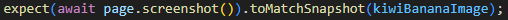
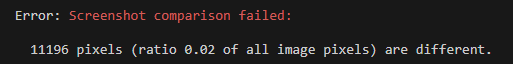
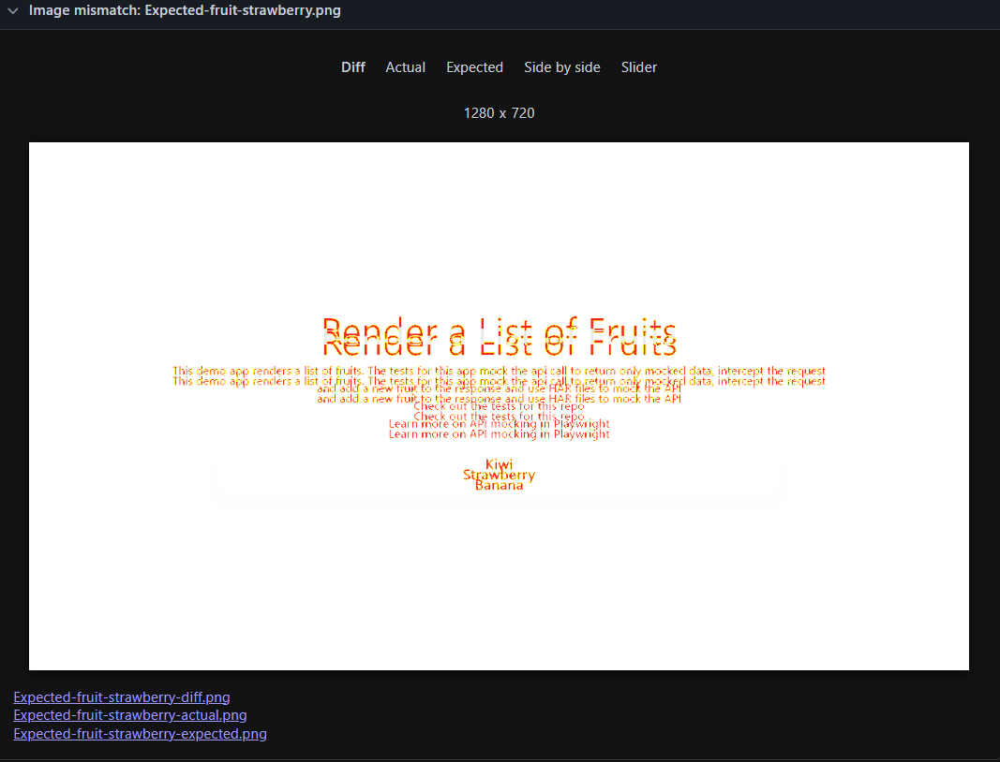
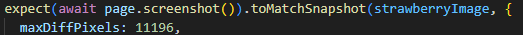

Playwright Basic Image assertion tests

1. CD to Frontend
2. Run "npx playwright test"
3. These may fail at first depending on if there are predetermined pngs in the codebase.

4. If they fail the user can create their own "Golden Standards". (The snapshot we are aiming to assert)
    We add this assertion to the end of the test as this is the snapshot we want to take.

-Note "kiwiBananaImage" is just a string variable of "Kiwi-Banana.png";
This is what we will name our gold standard snapshot.

After the test fails you will be presented with the actual outcomes inside e2e -> fruit_api.spec.ts-snapshots.

5. Now that you have these images run "npx playwright test --update-snapshots"
   It will now run through the test from start to finish and take a Snapshot before closing.

6. Now we have our gold standard snapshots. Only do this if you are happy with the output of the previously printed "Actual images".

- Rerun "npx playwright test" and your tests should now pass. (Theoreticlally)

7. You can create new gold standard images by changing the file inside "toMatchSnapshot()"
8. Currently the project is set up with images already, The user can use "kiwiBananaImage" or "strawberryImage" and test to see what happens.
9. On failure the user will be shown information like the pixel differenece and the ratio of difference between the actual and expected.
   
   The user can also view the web report to have better view of the changes.
   

10. There are also some parameters that the user can tweak. Inside toMatchnapshot method a user can specify a threshhold to pass the test.
    

- This test originally returns a Kiwi and a banana.
- But we can assert the strawberry image and have it pass because the level of difference is over 11196. If we specify 11195 then the test will fail.

- We can do something similar with "maxDiffPixelRatio" Instead of pixels it will heck percentage/ratio of difference to accept and pass the assertion.

11. If you want to see a big difference then navigate to a different website. For example Youtube or Google as opposed to the playwright API docs.
